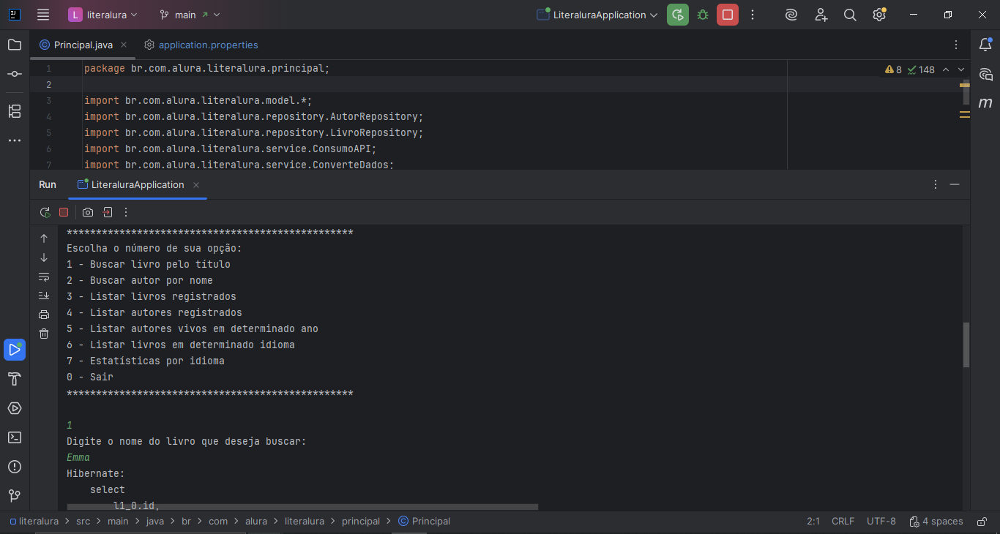
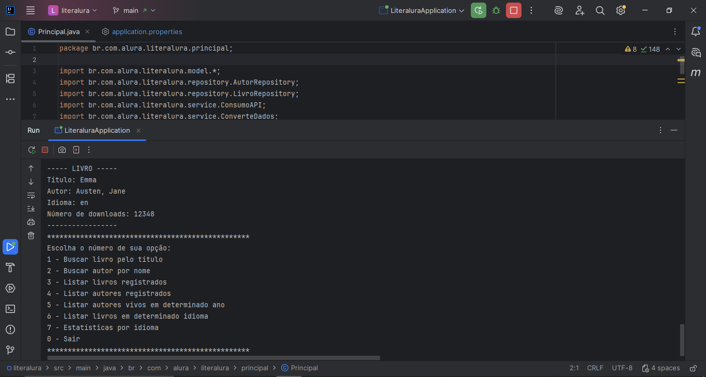
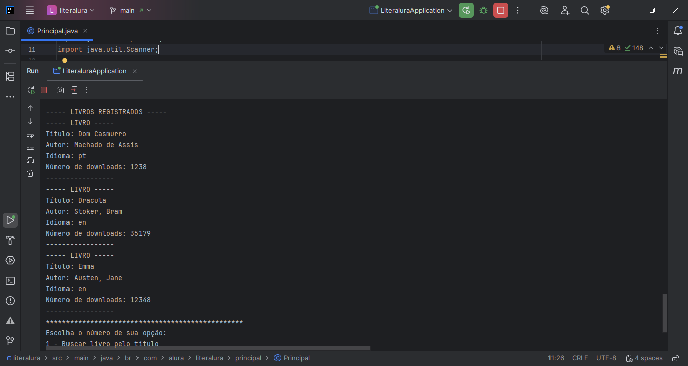
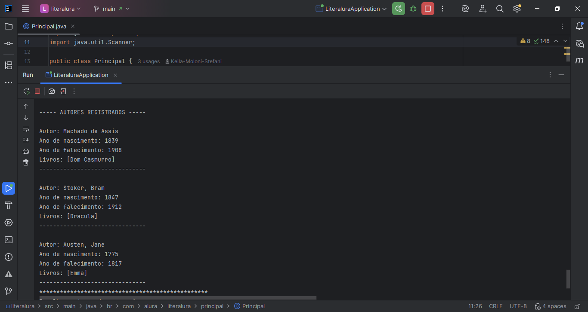

# 📚 LiterAlura - Catálogo de Livros

**LiterAlura** é um catálogo de livros interativo desenvolvido em Java que permite buscar, armazenar e consultar informações sobre livros e autores. O projeto consome dados da API Gutendex (com mais de 70 mil livros) e persiste as informações em um banco de dados PostgreSQL.

Este projeto foi desenvolvido como parte da Formação ONE (Oracle Next Education) em parceria com a Alura, do desafio **LiterAlura**, focando em:
- Consumo de APIs REST
- Persistência de dados com JPA/Hibernate
- Manipulação de JSON com Jackson
- Queries personalizadas com Spring Data JPA

---
## Demonstração

### Menu Principal
<p align="center">
  
</p>

### Resultado da Busca de Livros
<p align="center">
  
</p>

### Listagem Livros Registrados
<p align="center">
  
</p>

### Listagem Autores Registrados
<p align="center">
  
</p>

---
## Funcionalidades

- ✅ **Buscar livro pelo título** - Consulta a API Gutendex e salva no banco de dados
- ✅ **Listar livros registrados** - Exibe todos os livros salvos no banco
- ✅ **Listar autores registrados** - Exibe todos os autores e seus livros
- ✅ **Listar autores vivos em determinado ano** - Filtra autores por período histórico
- ✅ **Listar livros por idioma** - Filtra livros por idioma (PT, EN, ES, FR)
- ✅ **Buscar autor por nome** - Busca específica de autores no banco de dados
- ✅ **Estatísticas por idioma** - Exibe quantidade de livros por idioma

---

## Tecnologias Utilizadas

- **Java 21** - Linguagem de programação
- **Spring Boot 3.2.1** - Framework principal
- **Spring Data JPA** - Persistência de dados
- **Hibernate** - ORM (Object-Relational Mapping)
- **PostgreSQL** - Banco de dados relacional
- **Jackson** - Processamento de JSON
- **Maven** - Gerenciamento de dependências
- **Gutendex API** - Fonte de dados dos livros (gratuito)

---

## Pré-requisitos

Antes de executar o projeto, você precisa ter instalado:

- ✅ **JDK 21** ou superior - [Download](https://www.oracle.com/java/technologies/downloads/)
- ✅ **PostgreSQL 15** ou superior - [Download](https://www.postgresql.org/download/)
- ✅ **Maven** (ou use o Maven Wrapper incluído no projeto)
- ✅ **IDE** (IntelliJ IDEA, Eclipse, VS Code, etc.)

---

## Como Executar

### 1. Clone o repositório

```bash
git clone https://github.com/seu-usuario/literalura.git
cd literalura
```

### 2. Configure o Banco de Dados

Crie um banco de dados no PostgreSQL:

```sql
CREATE DATABASE literalura_db;
```

### 3. Configure as credenciais

Edite o arquivo `src/main/resources/application.properties`:

```properties
spring.datasource.url=jdbc:postgresql://localhost:5432/literalura_db
spring.datasource.username=postgres
spring.datasource.password=SUA_SENHA_AQUI
```

⚠️ **Substitua `SUA_SENHA_AQUI` pela senha do seu PostgreSQL!**

### 4. Execute o projeto

**Pela IDE:**
- Abra o projeto na IDE
- Execute a classe `LiteraluraApplication.java`

---

## Como Usar

Ao executar o projeto, você verá o menu interativo no console:

```
*************************************************
Escolha o número de sua opção:
1 - Buscar livro pelo título
2 - Listar livros registrados
3 - Listar autores registrados
4 - Listar autores vivos em determinado ano
5 - Listar livros em determinado idioma
6 - Buscar autor por nome
7 - Estatísticas por idioma
0 - Sair
*************************************************
```

### Exemplos de Uso:

**Buscar um livro:**
```
Digite: 1
Digite o nome do livro: Dom Casmurro
```

**Resultado:**
```
----- LIVRO -----
Título: Dom Casmurro
Autor: Machado de Assis
Idioma: pt
Número de downloads: 1238
-----------------
```

**Ver estatísticas:**
```
Digite: 7
```

**Resultado:**
```
===== ESTATÍSTICAS POR IDIOMA =====
Português: 3 livro(s)
Inglês: 5 livro(s)
Espanhol: 1 livro(s)
Francês: 0 livro(s)
====================================
```

---

## Estrutura do Projeto

```
literalura/
├── src/
│   ├── main/
│   │   ├── java/br/com/alura/literalura/
│   │   │   ├── LiteraluraApplication.java
│   │   │   ├── model/
│   │   │   │   ├── Autor.java
│   │   │   │   ├── Livro.java
│   │   │   │   ├── DadosAutor.java
│   │   │   │   ├── DadosLivro.java
│   │   │   │   └── DadosResposta.java
│   │   │   ├── repository/
│   │   │   │   ├── AutorRepository.java
│   │   │   │   └── LivroRepository.java
│   │   │   ├── service/
│   │   │   │   ├── ConsumoAPI.java
│   │   │   │   ├── ConverteDados.java
│   │   │   │   └── IConverteDados.java
│   │   │   └── principal/
│   │   │       └── Principal.java
│   │   └── resources/
│   │       └── application.properties
│   └── test/
├── pom.xml
└── README.md
```

---

## API Utilizada

Este projeto consome a **Gutendex API**:
- **URL Base:** https://gutendex.com/books/
- **Documentação:** https://gutendex.com/
- **Exemplo de busca:** https://gutendex.com/books/?search=dracula

A API é gratuita e possui dados de mais de 70.000 livros do Projeto Gutenberg.

---

## Resolução de Problemas

### Erro: "Connection refused" ao PostgreSQL"
**Solução:** Verifique se o PostgreSQL está rodando e se as credenciais estão corretas no `application.properties`

### Erro: "Database literalura_db does not exist"
**Solução:** Crie o banco de dados:
```sql
CREATE DATABASE literalura_db;
```

### Erro: "Livros não aparecem ao buscar"
**Solução:** Verifique sua conexão com a internet e se a API Gutendex está acessível

---

## Aprendizados

Este projeto proporcionou experiência prática em:

- ✅ Consumo de APIs REST com HttpClient
- ✅ Manipulação de JSON com Jackson
- ✅ Persistência de dados com JPA/Hibernate
- ✅ Relacionamentos entre entidades (OneToMany, ManyToOne)
- ✅ Queries personalizadas com JPQL
- ✅ Spring Data JPA e Derived Queries
- ✅ Padrão de projeto Repository
- ✅ Interação via console com usuário

---

## Licença

Este projeto foi desenvolvido para fins educacionais como parte do desafio LiterAlura da Alura.

---

## Desenvolvedor

Desenvolvido por Keila Moloni Stefani

⭐ Se este projeto foi útil para você, considere dar uma estrela!


